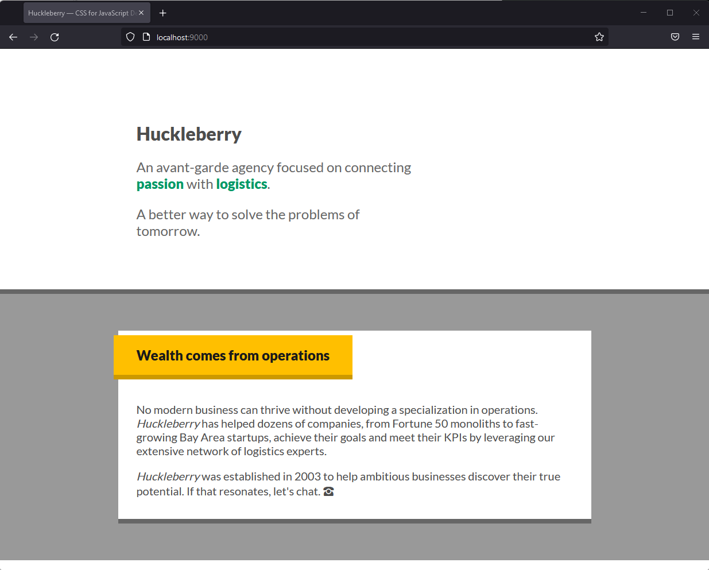

# huckleberry

A minimal landing page for an agency, using only flow layout.

Run the development server from this directory with:

```bash
# if live-server not installed:
# npm install -g live-server 

live-server --port=9000 --host=localhost .
```

Result:

